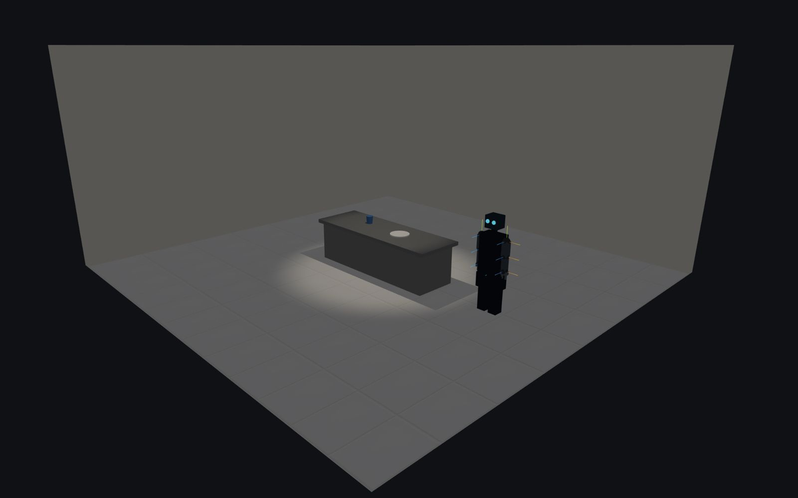
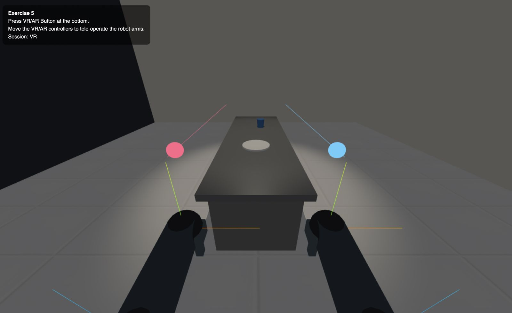

# Robot in the Kitchen

> **Live demo →** https://ossama971.github.io/Robot-In-The-Kitchen/

A robot wakes up in a kitchen. That's the premise. Over five exercises we build the whole thing from scratch using Three.js — starting with an empty room and ending with a robot you can puppeteer from inside a VR headset. Each exercise stacks on top of the last, so by the time you reach Exercise 5 you're looking at a fully lit, animated, mixed-reality tele-operation rig built entirely in the browser with no server and no build step.

| Full Scene | WebXR POV |
|:---:|:---:|
|  |  |

---

## What's in Here

The project is split into five stages. Each one is a self-contained page that imports the previous stage's setup, so you can open any exercise independently without losing context. Click a heading below to jump to its full technical breakdown.

**[Exercise 1 — Kitchen Scene](#exercise-1--kitchen-scene)**
We set up everything a proper 3D scene needs: a perspective camera, orbit controls, a shadow-capable renderer, and the kitchen itself — tiled floor, walls, a steel countertop, and a couple of props (a cup and a plate). Nothing moves yet, but the geometry and materials are already wired for PBR so lighting in Exercise 3 "just works."

**[Exercise 2 — Articulated Robot Hierarchy](#exercise-2--articulated-robot-hierarchy)**
The robot enters the scene. It's built as a proper scene-graph hierarchy — nested `THREE.Group` nodes where each group sits at a joint's pivot point, so rotating a group rotates everything hanging off it (exactly like a real skeleton). Shoulders, elbows, wrists, fingers, glowing eyes — all there.

**[Exercise 3 — PBR Lighting and Shadows](#exercise-3--pbr-lighting-and-shadows)**
A warm spotlight is hung above the counter and the whole scene goes from flat-shaded to physically correct. Shadow maps, bias tuning, per-surface roughness and metalness — all exposed through a lil-gui debug panel so you can tweak everything live. The mesh-collection logic is interesting too: it classifies scene objects by bounding-box dimensions at runtime rather than keeping manual references.

**[Exercise 4 — Procedural Animation and Manual Controls](#exercise-4--procedural-animation-and-manual-controls)**
The robot's arms start swinging in a sinusoidal wave. There's a full auto ↔ manual mode switch: when you touch a slider the animation freezes and the joint values snapshot into the GUI seamlessly. Anatomically correct rotation limits are applied on every axis.

**[Exercise 5 — WebXR Tele-operation](#exercise-5--webxr-tele-operation)**
Put on a headset, press the VR or AR button, and move your controllers — the robot's arms follow. Two-segment analytical IK (law of cosines) converts controller world positions into shoulder/elbow angles in real time. AR passthrough makes the virtual walls go semi-transparent so the kitchen feels like it's sitting on your actual desk.

---

## Running It

No build step needed — every page is a static HTML file. Just serve the root from a local server (required for ES module CORS rules):

```bash
# Python 3
python3 -m http.server 8080

# Node
npx serve .
```

Then open `http://localhost:8080`. The landing page links to all five exercises.

> **WebXR** needs HTTPS or `localhost`. Chrome on Android and Meta Browser on Quest both work well.

---

## Tech Stack

| | |
|---|---|
| Rendering | Three.js r0.182.0 (unpkg CDN, ES module importmap) |
| Module shim | es-module-shims v1.3.6 (broadens importmap browser support) |
| Debug GUI | lil-gui (bundled with Three.js addons) |
| XR entry | WebXR Device API — `VRButton` / `ARButton` |
| Build | None |

---

## Project Structure

```
index.html                        # Landing page
README.md
Materials/
  tiles.jpg                       # Tileable floor texture (2×2 repeat)
Figures/
  scene.jpeg                      # Full lit scene screenshot
  WEBXR.jpeg                      # WebXR POV screenshot
01-kitchen-scene/
  Exercise_1.html
  exercise1.js                    # Scene, camera, kitchen geometry
02-robot-hierarchy/
  Exercise_2.html
  exercise2.js                    # Robot scene-graph, materials
03-pbr-lighting/
  Exercise_3.html
  exercise3.js                    # SpotLight, shadow config, lil-gui
04-animation-interaction/
  Exercise_4.html
  exercise4.js                    # Animation state machine, joint GUI
05-webxr-teleop/
  Exercise_5.html
  exercise5.js                    # WebXR IK, world placement, AR passthrough
```

Dependency chain: `exercise1 ← exercise2 ← exercise3 ← exercise4 ← exercise5`

---

## Exercise 1 — Kitchen Scene

**Files:** `01-kitchen-scene/exercise1.js`, `01-kitchen-scene/Exercise_1.html`

Establishes the shared base scene consumed by all subsequent exercises. Returns `{ scene, camera, renderer, controls }`.

### Renderer

```js
WebGLRenderer({ antialias: true, alpha: true })
shadowMap.type = THREE.PCFSoftShadowMap
```

WebGL context-loss and context-restore events are handled: on restore the shadow map settings and pixel ratio are reapplied so the scene recovers without a page reload.

### Camera and Controls

```
PerspectiveCamera  FOV 50°  |  near 0.1  |  far 1000
position (0, 6, 12)  |  lookAt (0, 0, 0)
OrbitControls — target at world origin
```

The resize listener updates `camera.aspect` and calls `renderer.setSize` so the viewport stays correct at any window size.

### Geometry and Materials

All surfaces use `MeshStandardMaterial` from the start so they respond correctly to the `SpotLight` added in Exercise 3.

| Object | Geometry | Key dimensions | Material |
|---|---|---|---|
| Floor | `PlaneGeometry` | 10 × 10, rotated −π/2 X | Tile texture, `RepeatWrapping` 2×2, roughness 0.7 |
| Back wall | `BoxGeometry` | 10 × 5 × 0.15, z = −5 | Off-white, roughness 0.9 |
| Left wall | `BoxGeometry` | 0.15 × 5 × 10, x = −5 | Off-white, roughness 0.9 |
| Countertop | `BoxGeometry` | 3.4 × 0.08 × 1.15, y = 0.94 | Brushed steel (metalness 0.7, roughness 0.25) |
| Cabinet body | `BoxGeometry` | 3.2 × 0.9 × 1.0, y = 0.451 | Grey (metalness 0.1, roughness 0.6) |
| Cup | `CylinderGeometry` | r 0.08/0.065, h 0.18, 24 segments | Blue ceramic |
| Plate | `CylinderGeometry` | r 0.22, h 0.025, 36 segments | White (flat disc) |

Lighting at this stage is a single `AmbientLight(0xffffff, 0.35)` — enough to see the scene; proper shading is deferred to Exercise 3.

---

## Exercise 2 — Articulated Robot Hierarchy

**Files:** `02-robot-hierarchy/exercise2.js`, `02-robot-hierarchy/Exercise_2.html`

Imports the full Exercise 1 scene and adds the robot. Returns `{ scene, camera, renderer, controls, robot }` where `robot` exposes named joints for animation.

### Scene Graph

Each joint is a `THREE.Group` placed at the anatomical pivot point. Geometry meshes inside the group are Y-offset so their top edge aligns with the pivot, which means `group.rotation` rotates the limb about the correct axis without displacing it.

```
robotRoot (Group)  position (3.0, 0, 0)
├── legMesh_L / legMesh_R   BoxGeometry(0.18, 0.5, 0.2)
├── hipsMesh                BoxGeometry(0.5, 0.3, 0.3)  y = 0.65
└── torsoGroup (Group)      y = 0.8  ← hip-top pivot
    ├── torsoMesh           BoxGeometry(0.45, 0.8, 0.3)  y-offset +0.4
    ├── neckMesh            CylinderGeometry(r=0.06, h=0.12, 16 seg)  y = 0.86
    ├── headMesh            BoxGeometry(0.28, 0.25, 0.25)  y = 1.045
    ├── eye_L / eye_R       SphereGeometry(r=0.04)  emissive 0x00e5ff
    ├── leftArmChain
    │   └── shoulderGroup (Group)  x = +0.285, y = 0.72
    │       ├── upperArmMesh  BoxGeometry(0.12, 0.3, 0.12)  y-offset −0.15
    │       ├── jointSphere   SphereGeometry(r=0.07, chrome)
    │       └── elbowGroup (Group)  y = −0.3
    │           ├── forearmMesh  BoxGeometry(0.1, 0.3, 0.1)  y-offset −0.15
    │           ├── jointSphere  (chrome)
    │           └── handGroup (Group)  y = −0.3
    │               ├── wristSphere  (chrome)
    │               ├── palm   BoxGeometry(0.14, 0.07, 0.09)
    │               ├── finger_L  BoxGeometry(0.03, 0.09, 0.03)  x = −0.04
    │               └── finger_R  BoxGeometry(0.03, 0.09, 0.03)  x = +0.04
    └── rightArmChain  (mirror of left — sign = −1 on X)
```

`AxesHelper(0.3)` instances are added at each group origin for debugging joint placement.

### Materials

| Part | Hex | Metalness | Roughness |
|---|---|---|---|
| Body / torso / legs | `0x2e3d4f` (dark steel blue) | 0.7 | 0.3 |
| Limbs | `0x607080` (medium grey) | 0.5 | 0.4 |
| Hands | `0x8ba0b0` (light grey) | 0.6 | 0.2 |
| Joint spheres | `0xd0dde8` (chrome) | 0.95 | 0.05 |
| Head | `0x3a5068` (dark blue-grey) | 0.6 | 0.3 |
| Eyes | `0x00e5ff` + `emissiveIntensity: 0.6` | 0.2 | 0.1 |

### Robot Object API

```js
robot.root          // THREE.Group — whole robot (translate / rotate here)
robot.torso         // THREE.Group — torso pivot (y = 0.8 relative to root)
robot.arms.left.shoulder   // THREE.Group — left shoulder pivot
robot.arms.left.elbow      // THREE.Group — left elbow pivot
robot.arms.left.hand       // THREE.Group — left wrist pivot
robot.arms.right.*         // same structure, mirrored
```

---

## Exercise 3 — PBR Lighting and Shadows

**Files:** `03-pbr-lighting/exercise3.js`, `03-pbr-lighting/Exercise_3.html`

Imports Exercise 2, adds a `SpotLight` over the counter, and opens a lil-gui panel for runtime tuning. Returns the full scene plus `{ ambient, mainLight, refs, gui }`.

### Lighting Configuration

```
AmbientLight    0xffffff  intensity 0.35  (reused from Exercise 1)

SpotLight
  color         0xfff1dc  (warm white)
  intensity     2.2
  distance      16 m
  angle         π/5  (~36°)
  penumbra      0.35
  decay         1
  position      (0, 3.8, 0)
  target        countertop centroid
  shadow.mapSize  1024 × 1024
  shadow.bias     −0.00015  (reduces shadow acne)
  shadow.normalBias  0.02   (reduces peter-panning)
  shadow.camera.near  0.5 / far  25
```

### Scene Traversal

Rather than storing mesh references at creation time, Exercise 3 traverses the live scene graph and classifies objects by geometry type and bounding-box dimensions:

| Detection | Criteria |
|---|---|
| Floor | `geometry.type === "PlaneGeometry"` |
| Countertop | `BoxGeometry` + `y ∈ (0.85, 1.05)` + `width > 2.5` + `height < 0.12` |
| Cabinet body | `BoxGeometry` + `y ∈ (0.3, 0.6)` + `height > 0.8` + `width > 2.5` |
| Counter objects | `y ∈ (0.95, 1.25)` and not in robotMeshes |

`ensureMeshStandard()` converts any non-standard material to `MeshStandardMaterial`, preserving color and texture map, so every surface participates in PBR shading.

### lil-gui Panels

- **Ambient Light** — intensity `[0, 1.5]`
- **Main Spot Light** — intensity, angle, penumbra, distance, position XYZ
- **Shadow Quality** — bias, normalBias; map size dropdown (512 / 1024 / 2048); changing map size calls `.map?.dispose()` then sets `.map = null` so Three.js re-creates the shadow map at the new resolution on the next render
- **Robot Material** — roughness and metalness, propagated to all robot meshes via `applyMaterialParams()`
- **Objects Material** — roughness and metalness for counter objects
- **Counter Material** — roughness and metalness, synced to the cabinet body

---

## Exercise 4 — Procedural Animation and Manual Controls

**Files:** `04-animation-interaction/exercise4.js`, `04-animation-interaction/Exercise_4.html`

Imports Exercise 3 and adds a time-driven animation loop plus a GUI that switches between automatic and manual joint control. Returns `{ ..., animateRobot, gui }`.

### Animation

`animateRobot()` is called every frame before `renderer.render()`.

**Auto mode** (default `animState.autoAnimate = true`):

```
t = Date.now() * 0.001 * speed

left shoulder  Z = +|sin(t)| * amplitude   (abduction sweep outward)
left elbow     X = −|sin(t)|               (flexion follows shoulder)
right shoulder Z = −|sin(t)| * amplitude   (mirrored)
right elbow    X = −|sin(t)|
```

`speed` multiplies the time scalar (range 0.1 – 5); `waveAmplitude` caps the shoulder angle (range 0 – π/2).

### Auto ↔ Manual Transition

Switching **auto → manual** snapshots all six live joint rotation values into `jointAngles` so sliders pick up exactly at the robot's current pose. Sliders are refreshed with `.updateDisplay()` to reflect the snapshotted values.

Moving any manual slider **while in auto mode** auto-transitions: all joints are snapshotted, the moved joint is updated, and `autoAnimate` is set to `false` — the animation freezes in place with the slider change already applied.

### Joint Limits

| Joint | Axis | Range (radians) |
|---|---|---|
| Left shoulder | Z — abduction/adduction | 0 → +π/2 |
| Left shoulder | X — flexion/extension | −π/2 → +π/4 |
| Left elbow | X — flexion | −π/1.25 → 0 |
| Right shoulder | Z — abduction/adduction | −π/2 → 0 |
| Right shoulder | X — flexion/extension | −π/2 → +π/4 |
| Right elbow | X — flexion | −π/1.25 → 0 |

---

## Exercise 5 — WebXR Tele-operation

**Files:** `05-webxr-teleop/exercise5.js`, `05-webxr-teleop/Exercise_5.html`

Imports Exercise 4 and adds VR and AR entry points. In XR, the robot arms are driven in real time by controller position via analytical inverse kinematics. Returns `{ ..., worldRoot, controllers, teleop, updateTeleoperation }`.

### World Root and XR Placement

All existing scene children are re-parented under a `worldRoot` Group. On XR session start:

1. `worldRoot.rotation.y = −π/2` rotates the whole scene so the robot's forward direction (`−X`) aligns with the user's natural forward (`−Z`).
2. The robot eye position is computed from the known hierarchy offsets (`torso y=0.8`, eye `y=1.06, z=0.13` relative to torso) then rotated by step 1. The XZ components are negated and applied as `worldRoot.position` so the eye lands at the XR origin.
3. On the **first XR frame** (when the headset pose is available via `camera.position.y`): `worldRoot.position.y = camera.position.y − robotEye.y` — the virtual robot eye height is calibrated to the user's physical eye height.

In AR/passthrough mode, an additional `arWorldYOffset` slider (exposed via GUI) fine-tunes vertical alignment.

On session end, `worldRoot` rotation and position are reset to zero and the original OrbitControls camera pose is restored.

### Inverse Kinematics

Two-segment analytical IK runs per arm per frame:

**Step 1 — Target in torso space**

```
targetWorld  = controller.getWorldPosition()
targetLocal  = robot.torso.worldToLocal(targetWorld)
shoulderToTarget = targetLocal − shoulder.position
```

**Step 2 — Shoulder pose from `shoulderToTarget` unit vector `d`**

```
outward  = (side === "left") ? d.x : −d.x
downward = −d.y

shoulderZ_mag = atan2(outward, downward)              // abduction
lateralMag    = hypot(outward, downward)
shoulderX     = −atan2(d.z, max(0.001, lateralMag))  // flexion (−Z = forward)

shoulderZ = sign(side) * shoulderZ_mag                // mirrored for right arm
```

**Step 3 — Elbow angle via law of cosines**

```
a = b = 0.3 m  (upper arm and forearm lengths)
c = clamp(reach, 0.12, 0.58)

elbow_angle = acos((a² + b² − c²) / (2ab)) − π
```

**Step 4 — Apply with smoothing**

```
shoulder.rotation.z = lerp(current, targetShoulderZ, 0.4)
shoulder.rotation.x = lerp(current, targetShoulderX, 0.4)
elbow.rotation.x    = lerp(current, elbowAngle,      0.4)
```

**Step 5 — Wrist orientation**

```
handLocal = elbow_world_quat⁻¹ × controller_world_quat
hand.quaternion.slerp(handLocal, 0.85)
```

### AR Passthrough

Session passthrough is detected via `session.environmentBlendMode ∈ {"alpha-blend", "additive"}`. When active:

- `scene.background` is set to `null` (transparent)
- Wall materials (back wall and left wall, identified by bounding-box size) are snapshotted then overridden: `transparent = true`, `opacity = 0.14`, `depthWrite = false`
- Originals are restored on session end

### Controllers

`renderer.xr.getController(0)` and `getController(1)` are used. Each controller renders a colored ray (left: `0x66ccff`, right: `0xff6688`) and a small tip sphere for spatial feedback. Handedness is resolved from `XRInputSource.handedness` on the `connected` event; the `findController()` helper falls back to index order when handedness is not yet set.

When not in an XR session, `animateRobot()` from Exercise 4 runs so the desktop view keeps the auto-animation playing.

### Teleop Parameters

| Parameter | Default | Description |
|---|---|---|
| `smoothing` | 0.4 | LERP fraction per frame toward IK target |
| `reachScale` | 1.0 | Scales the shoulder-to-target distance before elbow IK |
| `handFollow` | 0.85 | SLERP fraction per frame for wrist orientation |
| `showDebugTargets` | false | Renders coloured spheres at IK target positions |
| `arWorldYOffset` | 0.0 | Additional vertical offset applied in AR passthrough |
